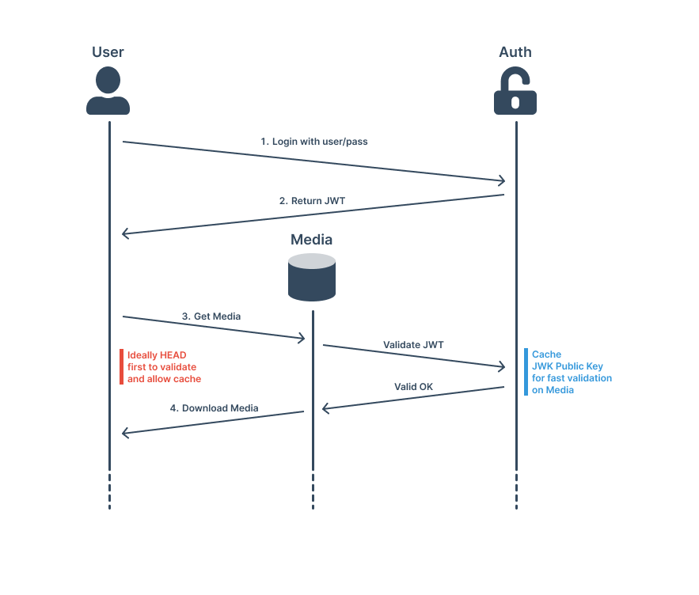

# BarTAB Chat - Design Draft

> **Status:** Architecture Design Phase - No implementation code yet

We use Discord. Or rather, we *used to* enjoy using Discord.

Since Discord got bought out, it's been going downhill fast. Here in Australia, they're now requiring photos for prove age verification. Last week Discord had a data breach where this ID data was stolen. That's the final straw.

As grass touching developers who are sick of this shit and want to go back to the time of monkey, we thought it would be funny (and useful) to build our own simpler version. The alternatives to Discord aren't great, and Discord basically has a monopoly on this space. So here we are... building a lightweight, self-hostable chat system that we actually control. Until we forget and drop the project (tm).

## What We're Building

A lightweight group chat system that's self-hostable, modular, and developer-friendly. Each server runs as its own independent instance, managing its own users, rooms, and media. No corporate overlords, no ID requirements, no data breaches of your personal documents until we realised we cooked the media storage and ended leaking data?

The core design is pretty simple:

- **Append Only Logs (AOL):** Everything is an event in order. No weird state bugs.
- **Composable microservices:** Clean APIs between services. Each does one thing well.

We're starting with **plaintext messaging for the MVP** because let's be real, we need something that actually works first. Once that's "solid", or if we have someone who has a high ABV score and motivation for developing this, we'll add proper **end-to-end encryption** using Olm (Signal like) or Megolm (Matrix like).

> **Note:** I don't usually like microservices (they're often overkill), but the way we're splitting this up should actually make sense for scaling and potentially doing multi-tenant stuff later. Before you say, "You expect people to actually use this?", I more mean multi-tenant so we can have a test-server and prod-server using the same auth and/or media service for bot testing etc.

## Key Concepts

- **Bots are first-class citizens:** They use the same APIs as regular clients so we should have a strong SDK for this. Let's build snail race on another platform.
- **Media handling that doesn't suck:** Dedicated media service handles uploads, thumbnails, and caching lets say mini CDN-like.
- **Simple auth that actually makes sense:** JWT tokens for everything. Maybe OIDC later if we need it or think it could be funny.
- **Long polling instead of WebSocket hell:** The `/sync` endpoint just works. No sticky sessions, no reconnection chaos, no fucking about with websockets or SSE.

## Deployment

Everything runs in Docker containers with SQLite. The end. We'll add backup scripts so you don't lose your data maybe. Ideally, we also build some developer tools which can help manage the environment as well.

Bots can run as containers in the same Docker stack which could be nice having it all connected via internal virtual networks. But we do need to have a way for them to connect remotely as well. 

## Core Components

We split this thing into three services that work together:

1. **Authentication Service**: Handles logins, creates JWT tokens, and tells other services who's allowed to do what. Without this running, nothing else works.

2. **Chat Service**: Rooms, messages, who's online. Everything goes into an append-only log so message order never gets screwed up (tm). Uses long polling to deliver updates.

3. **Media Service**: Handles file uploads and downloads. Basically a mini CDN with thumbnail generation. Can serve files publicly or require auth.

All services have health checks and discovery endpoints so you know when stuff breaks.

The Chat and Media services depend on the Authentication Service and cannot operate without it. The following sequence chart illustrates the authentication flow:

## Request for Discussion (RFD) Process

I've been following [Oxide](https://oxide.computer/) through the [Changelog Podcast](https://changelog.com/) and they kept mentioning that they write RFDs for new ideas. I like this concept and would like to implement it for important design features once we have a base system.

1. Create a markdown file in `/rfd/` (like `RFD-0001-idea.md`)
2. Share it with everyone for feedback
3. Iterate until we all agree or decide it's a bad idea through appropriate abuse.

[Check out how Oxide does it](https://rfd.shared.oxide.computer/rfd/0001)

> **Note**: If this feels like overkill, just open a GitHub issue. I'm not that formal.

## Tech Stack (Planned)

**Backend:**
- Language: Go
- Database: SQLite for now, Postgres when people bitch about it
- Auth: JWTs with RS256/ES256/EdDSA
- Containers: Docker

**Frontend:**
- Web: Maybe Vue or React. Or HTMX if we're feeling chaotic
- Desktop: Probably Wails (Go) or Tauri (Rust)
- CLI: Charm.sh because it's just cool, any excuse to use charm

## MVP Scope

**What we're actually building first:**
- Basic login (username/password to JWT token)
- Create rooms (admins only for now)
- Send plaintext messages (encryption comes later)
- Upload files and images
- Long polling for real-time updates
- Docker deployment
- SQLite database

**Stuff we're NOT doing yet:**
- End-to-end encryption (E2EE)
- 2FA/MFA 
- OIDC
- Fancy permissions
- Reactions 
- Typing indicators
- Read receipts
- PostgreSQL
- Federation
- Custom emotes

## Project Status

This repo is just design docs right now. We're figuring out what to build before we build it.

**When we're happy with the design:**
- We'll make a proper repo with actual code
- Docs will get their own folder
- Maybe a fancy docs website if we're feeling professional
- All the CI/CD automation stuff
- Funny Logo??

**Right now we're just:**
- Arguing about architecture
- Making sure the design isn't stupid
- Figuring out how to make this not suck to deploy